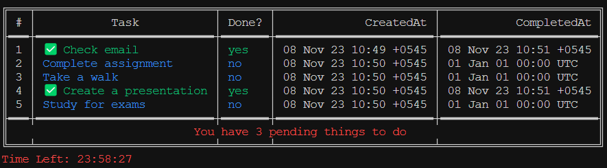

# GoDo

Godo is a command-line to-do application built with Go. With GoDo, you can easily manage your tasks, add new to-dos, mark them as done, list your tasks in a table format, and delete them as needed.



## Installation

To get started with GoDo, you'll need to [install Go](https://golang.org/doc/install) if you haven't already. Then, clone this project and you can install it with the following command:

```
go install ./cmd/todo/godo.go
```

## Example

1. Add a new task:

   ```bash
   godo -add Buy groceries
   ```

2. List your tasks:

   ```bash
   godo -list
   ```

   This will display your tasks in a table format, including the task index, task name, creation date, and completion date.

3. Mark a task as done:

   ```bash
   godo -done=1
   ```

   This will mark the task at index 1 as completed.

4. Delete a task:

   ```bash
   godo -del=2
   ```

   This will delete the task at index 2 from your list.

5. Delete all tasks:

   ```bash
   godo -delAll
   ```

   This will delete all the tasks from your list.
